# Настройка Visual Studio Code

## Начальная настройка

### Шаг 0

Установите самую свежую версию [VScode](https://code.visualstudio.com/download).

### Шаг 1

Откройте VScode и установите расширение [Dev Containers](https://marketplace.visualstudio.com/items?itemName=ms-vscode-remote.remote-containers) в левом меню `Extensions`.

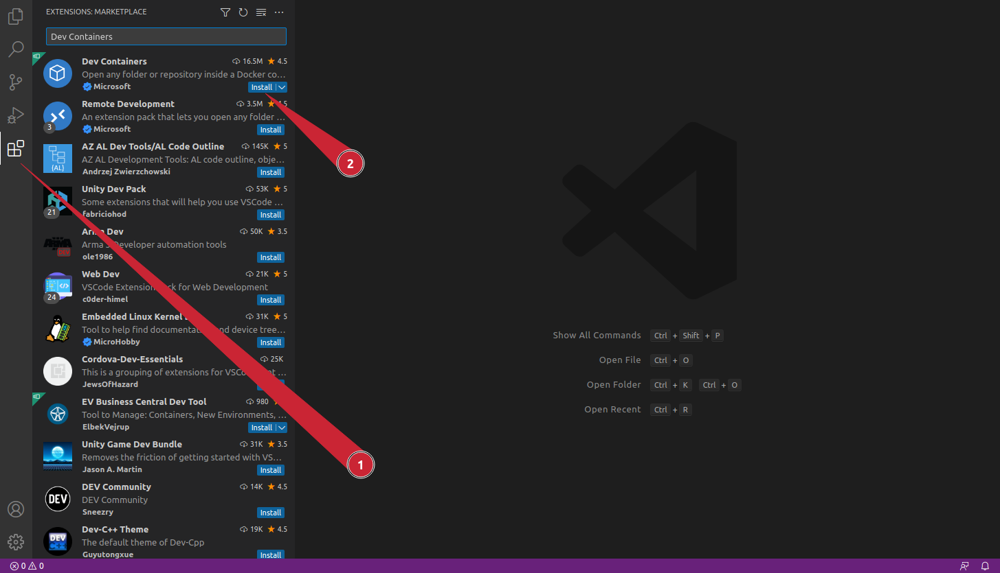

### Шаг 2

После установки расширения откройте вкладку `Remote Explorer`. Проверьте, что в списке контейнеров присутствует контейнер с курсом, который был создан и запущен на [шаге настройки Docker](docker.md). Он должен называться `concurrency-course`. 

Подключитесь к контейнеру с помощью кнопки `Attach to Container` и дождитесь настройки контейнера для работы с VScode.

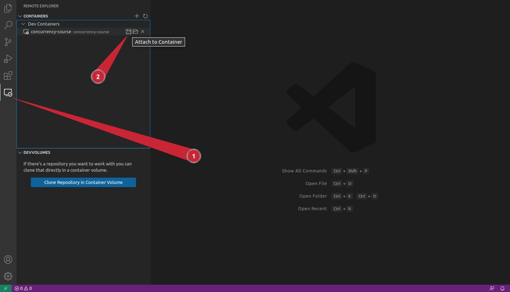

На этом шаге у вас должно открыться дополнительное окно с VScode, подключенным к контейнеру.

Проверьте, что подключение успешно: в левом нижнем углу должно отображаться имя контейнера.

### Шаг 3

Курс – это CMake-проект, так что просто откройте его в VScode с подключенным контейнером: вкладка `Explorer` > `Open Folder` > выбрать директорию курса в контейнере (`/workspace/concurrency-course`).

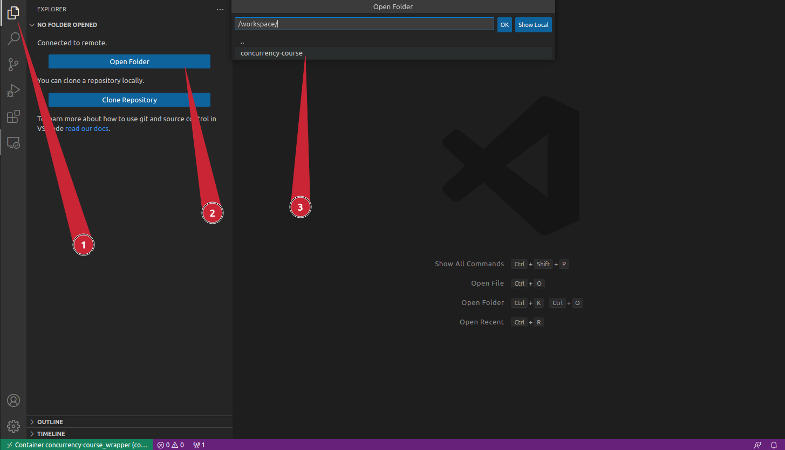

## Настройка окружения

### Шаг 0

Для работы с курсом нужно установить в контейнер следующие расширения аналогично тому, как было установлено расширение Dev Containers:

| Расширение | Функционал |
|---|---|
| _[CMake Tools](https://marketplace.visualstudio.com/items?itemName=ms-vscode.cmake-tools)_ | Поддержка CMake |
| _[C/C++](https://marketplace.visualstudio.com/items?itemName=ms-vscode.cpptools)_ | Запуск и дебаг кода
| _[clangd](https://marketplace.visualstudio.com/items?itemName=llvm-vs-code-extensions.vscode-clangd)_ | Навигация и автодополнение |

После установки расширения `clangd` и начала работы с кодом VScode предложит установить `clangd`. С установкой нужно согласиться.

### Шаг 1

После установки расширения для работы с CMake выберите kit - `Clang 12.0.0 x86-64-pc-linux-gnu`. Это можно сделать сразу после установки расширения либо в нижней панели.

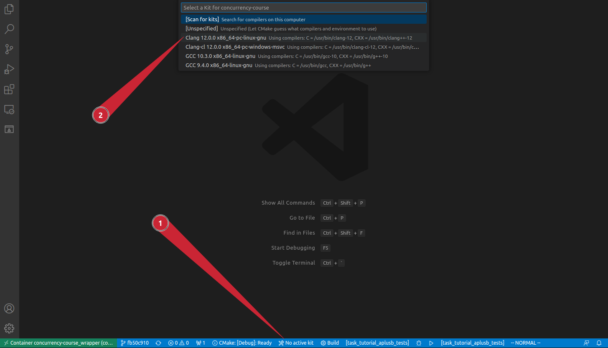

### Шаг 2

Установите генератор `Unix Makefiles` для CMake. Для этого откройте настройки расширения `CMake Tools` в меню слева под названием `Extensions`.

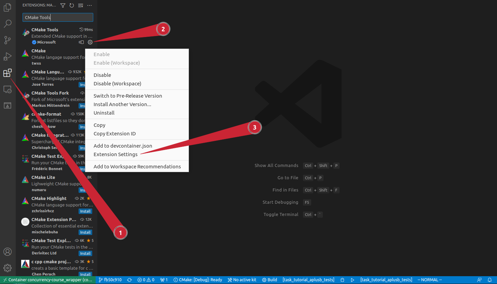

Теперь переключитесь на настройки в группе `Workspace` и найдите настройку `Cmake: Generator`. Установите её значение на `Unix Makefiles`.

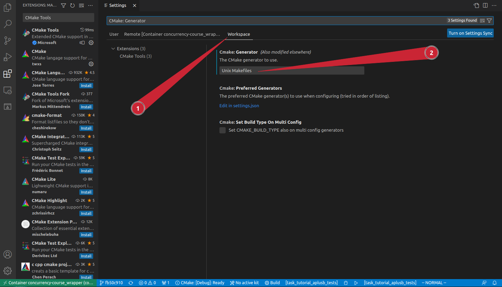

Убедитесь, что настройка задана верно. Для этого проверьте, что файл `.vscode/settings.json` содержит строку
```
    "cmake.generator": "Unix Makefiles"
```

**Внимание:** после этого шага нужно перезагрузить полностью VScode и снова подключиться к контейнеру.

Теперь запустить CMake можно из нижнего меню, выбрав профиль сборки `Debug`.
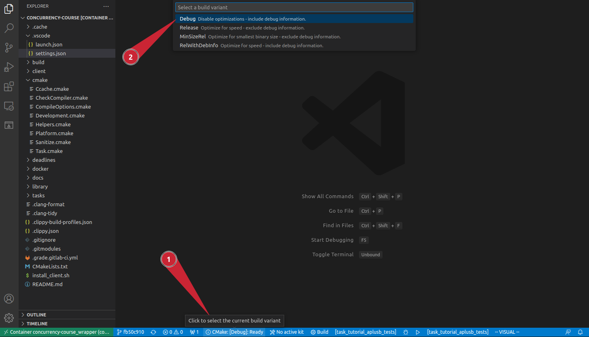

Также из этого меню можно собирать и запускать цели, соответствующие задаче.

Сначала выберите цель для сборки и соберите её.
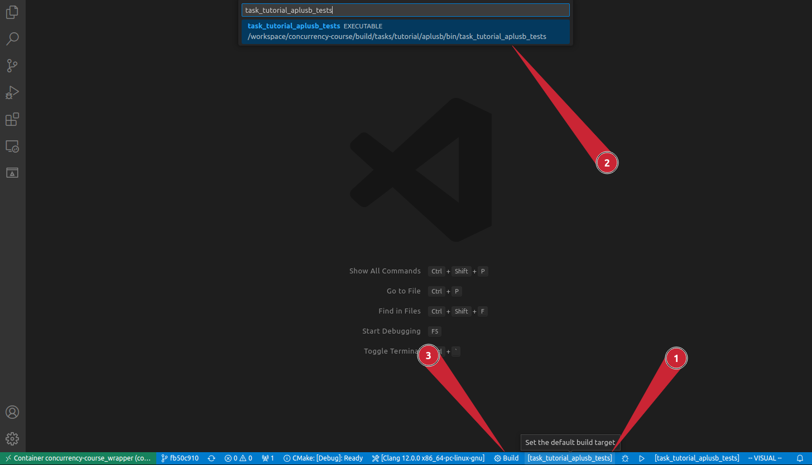

Далее можно выбрать цель для запуска и запустить её.
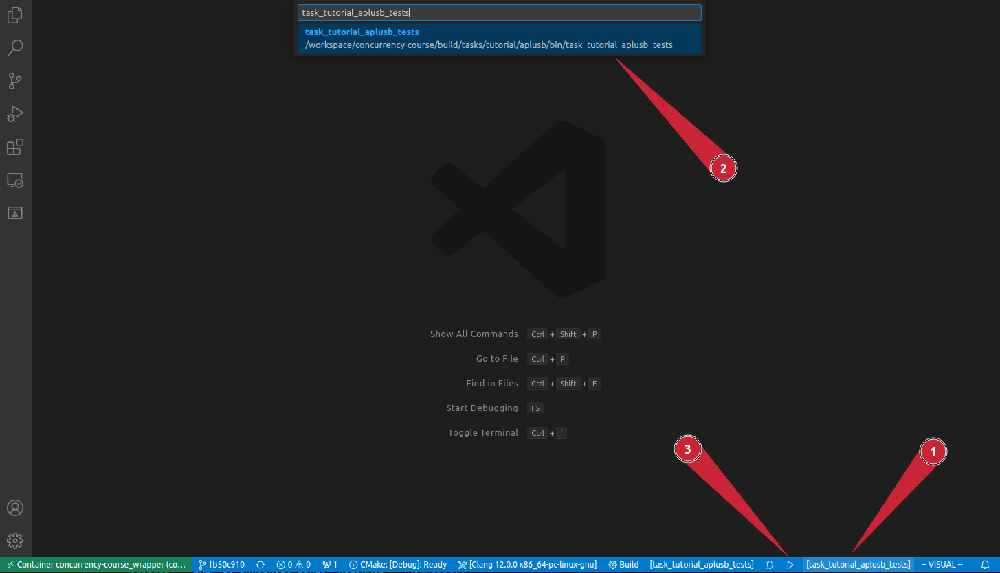

### Шаг 2

В течение курса может понадобиться дебаггер. Для его настройки откройте сначала любой `.cpp` файл. 

В левом меню откройте `Run and Debug` и нажмите `create a launch.json file`
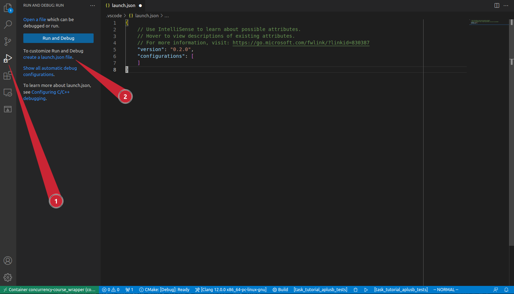

Теперь нажмите `Show all automatic debug configurations` > `Add Configuration...` > `C/C++: (gdb) Launch`. 
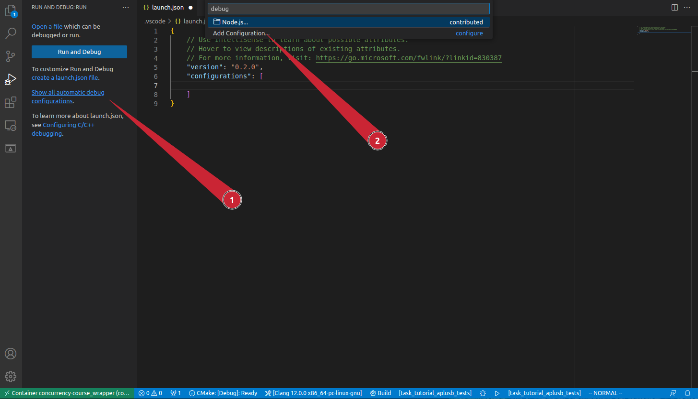


В файле `.vscode/launch.json` будет создан шаблон, который нужно заполнить. 
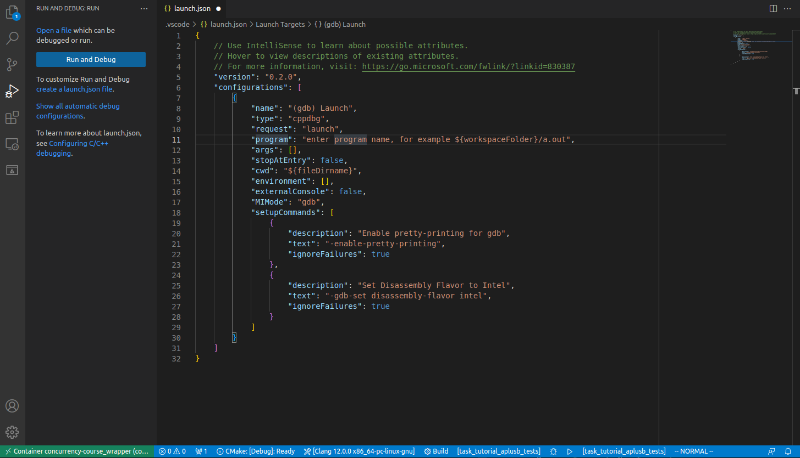

В этом файле нас интересуют следующие поля:
- `program` — путь до бинарного файла тестов задачи. Например, `/workspace/concurrency-course/build/tasks/tutorial/aplusb/bin/task_tutorial_aplusb_tests`
- `args` — аргументы командной строки для бинарного файла. Для установки breakpoint'ов нужно выключить запуск тестов в подпроцессе. Для этого добавьте флаг `--disable-forks`. Подробнее можно прочитать в [faq](faq.md).

Должен получится такой файл. Не забудьте его сохранить!
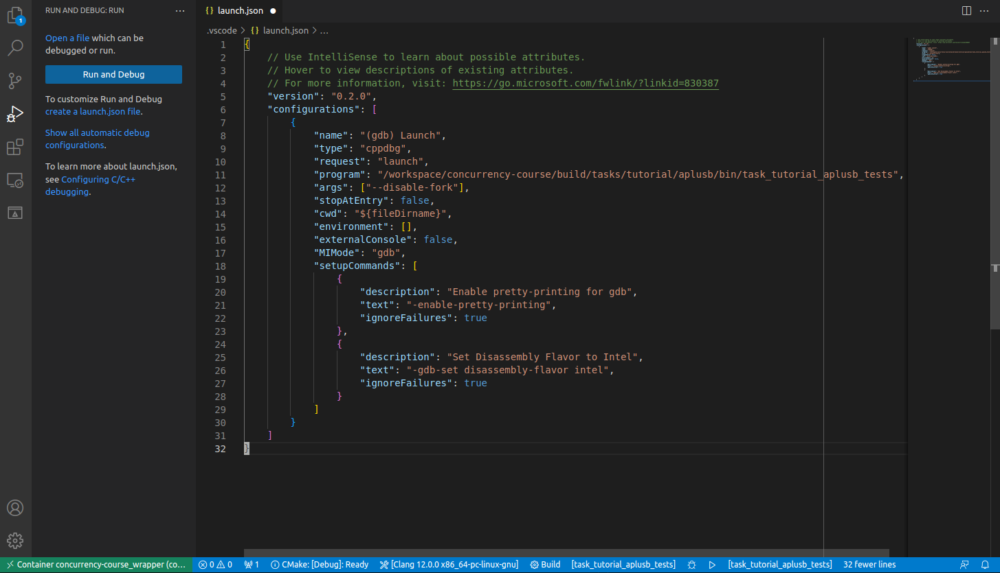

Теперь можно запускать дебаггер из меню слева `Run and Debug`.
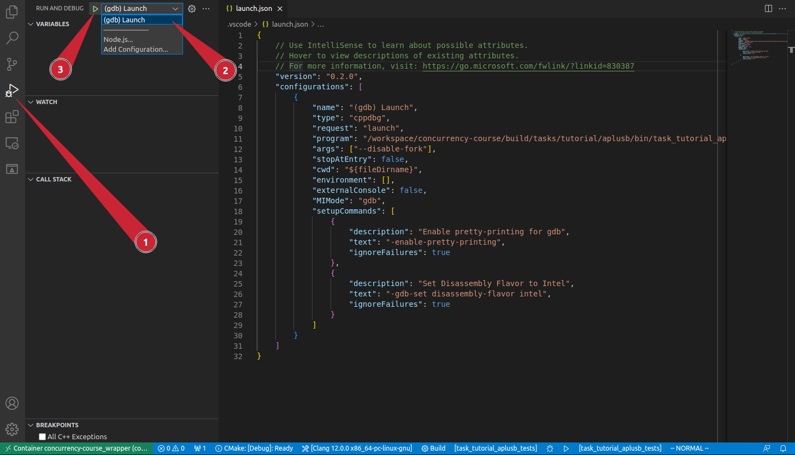

## Полезные советы

- В окошке `Terminal` > `New Terminal` можно залогиниться в контейнер и работать там с консольным клиентом `clippy` не покидая VScode.
