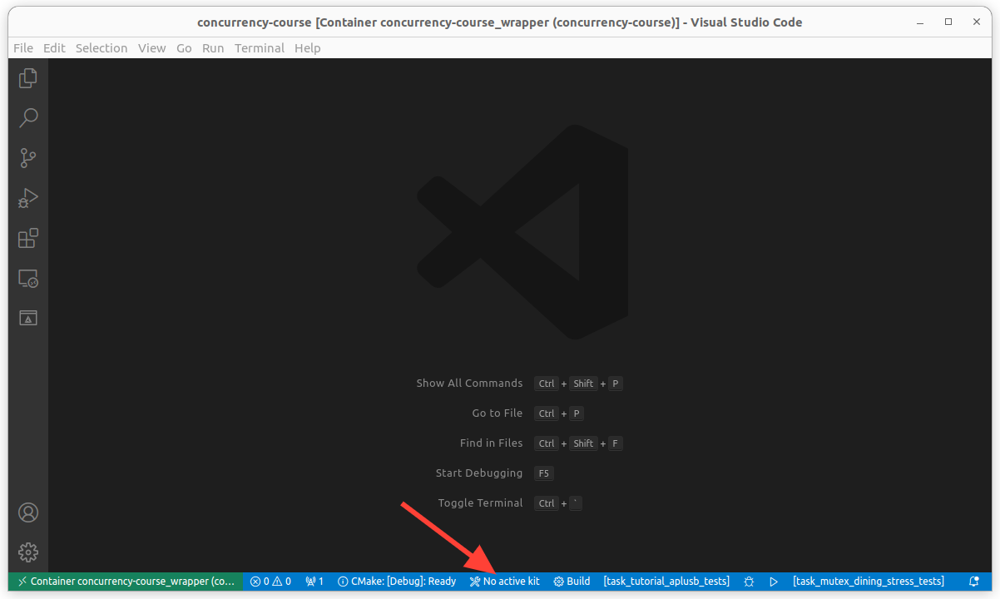
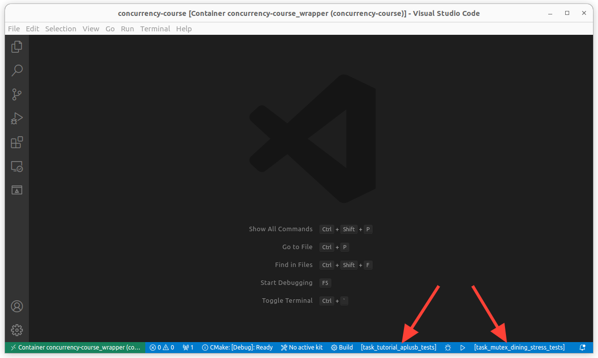

# Настройка Visual Studio Code

## Начальная настройка

### Шаг 0

Установите самую свежую версию [VScode](https://code.visualstudio.com/download).

### Шаг 1

Откройте VScode и установите расширение [Dev Containers](https://marketplace.visualstudio.com/items?itemName=ms-vscode-remote.remote-containers).

### Шаг 2

После установки расширения откройте вкладку `Remote Explorer`. Проверьте, что в списке контейнеров присутствует контейнер с курсом, который был создан и запущен на шаге настройки Docker. Он должен называться `concurrency-course`. 

Подключитесь к контейнеру с помощью кнопки `Attach to Container` и дождитесь настройки контейнера для работы с VScode.

Проверьте, что подключение успешно: в левом нижнем углу должно отображаться имя контейнера.

### Шаг 3

Курс – это CMake-проект, так что просто откройте его в VScode с подключенным контейнером: вкладка `Explorer` > `Open Folder` > выбрать директорию курса в контейнере (`/workspace/concurrency-course`).

Теперь можно редактировать файлы с помощью VScode и запускать тесты с помощью clippy.

## Настройка окружения

### Шаг 0

Для удобной работы с курсом можно установить в контейнер следующие расширения:

| Расширение | Функционал |
|---|---|
| _[CMake Tools](https://marketplace.visualstudio.com/items?itemName=ms-vscode.cmake-tools)_ | Поддержка CMake |
| _[C/C++](https://marketplace.visualstudio.com/items?itemName=ms-vscode.cpptools)_ | Запуск и дебаг кода
| _[clangd](https://marketplace.visualstudio.com/items?itemName=llvm-vs-code-extensions.vscode-clangd)_ | Навигация и автодополнение |

### Шаг 1

После установки расширения для работы с CMake выберите kit - `Unspecified`. Это можно сделать сразу после установки расширения либо в нижней панели.

Для сборки CMake теперь можно воспользоваться кнопкой левее.

Теперь можно компилировать и запускать отдельные таргеты. Выбрать их также можно в нижней панели.

### Шаг 2 (опциональный)

В течение курса может понадобиться дебаггер. Для его настройки откройте какой-нибудь `.cpp` файл. 

В левом меню откройте `Run and Debug` и нажмите `create a launch.json file`, а потом `Show all automatic debug configurations` > `Add Configuration...` > `C/C++: (gdb) Launch`. 

В файле `.vscode/launch.json` будет создан шаблон, который нужно заполнить. 

В этом файле нас интересуют следующие поля:
- `program` — путь до бинарного файла. Например, `/workspace/concurrency-course/build/tasks/tutorial/aplusb/bin/task_tutorial_aplusb_tests`
- `args` — аргументы командной строки для бинарного файла. Для установки breakpoint'ов нужно выключить запуск тестов в подпроцессе. Для этого добавьте флаг `--disable-forks`. Подробнее можно прочитать в [faq](faq.md).

Теперь можно запускать дебаггер из меню слева `Run and Debug`.

## Полезные советы

- В окошке `Terminal` > `New Terminal` можно залогиниться в контейнер и работать там с консольным клиентом `clippy` не покидая VScode.
