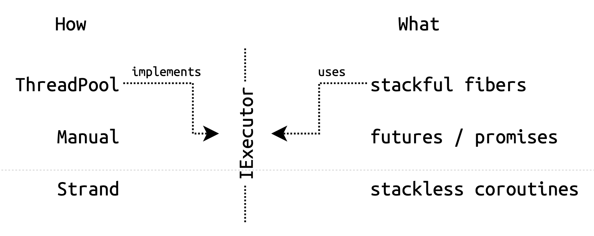

# Executors

## Пререквизиты

- [fibers/coroutine](/tasks/fibers/coroutine)

## Декомпозиция

_Stackful файберы_, _фьючи_, _stackless корутины_ – это _выразительные средства_, с помощью которых разработчик описывает конкурентные активности в своем коде.

Для разработчика, который ими пользуется, эти средства существенно отличаются друг от друга. А для _среды исполнения_ (пула потоков) они, наоборот, выглядят одинаково – как цепочки неблокирующихся задач.

Конкурентность в нашем дизайне декомпозирована:
- _Выразительные средства_ описывают цепочки задач
- _Среда исполнения_ исполняет эти цепочки

## Абстракция

В этой задаче мы абстрагируем среду исполнения: файберы, фьючи и корутины будут запускать свои задачи не в пуле потоков, а в абстрактном _экзекуторе_.

## Дизайн

Средства выразительности описывают _что_ исполнять, экзекуторы – _как_ исполнять.



## Executor

_Executors are to function execution as allocators are to memory allocation_

_Экзекутор_ (_executor_) – это сервис, исполняющий задачи. 

Представлен интерфейсом [`IExecutor`](exe/executors/executor.hpp) с единственным методом `Execute` – запланировать задачу на исполнение.

Единственная гарантия, которую экзекутор дает пользователю: запланированная в него задача будет выполнена.

В каком потоке и когда именно – зависит от конкретной реализации интерфейса `IExecutor`. Механика исполнения скрыта от пользователя за виртуальным вызовом.

## Примеры

### Пул потоков

[`ThreadPool`](exe/executors/tp/thread_pool.hpp) – статический набор потоков, разбирающих общую очередь задач.

```cpp
void ThreadPoolExample() {
  using namespace exe;
  
  // ThreadPool реализует интерфейс IExecutor
  // `Submit` превратился в `Execute`
  executors::ThreadPool pool{/*threads=*/4};
  
  // Планируем задачу в пул потоков
  executors::Execute(pool, []() {
    std::cout << "Hi!" << std::endl;
  });
  
  // Дожидаемся завершения всех задач
  pool.WaitIdle();
  // Останавливаем пул
  pool.Stop();
}
```

#### Применение

Мы уже использовали пул потоков как планировщик для файберов:

```cpp
void FibersExample() {
  using namespace exe;
  
  executors::ThreadPool pool{4};

  // Функция Go теперь принимает IExecutor&
  fibers::Go(/*executor=*/pool, []() {
    for (size_t i = 0; i < 7; ++i) {
      fibers::self::Yield();
    }
  });
  
  pool.WaitIdle();
  pool.Stop();
}
```

Файбер не знает про конкретную реализацию экзекутора, в котором его запускают. Реализация файберов должна полагаться только на абстракцию `IExecutor` и на базовую гарантию, которую та предоставляет.


### Manual

[`ManualExecutor`](exe/executors/manual.hpp) – это всего лишь очередь задач. Вызов `Execute` добавляет задачу в конец этой очереди.

Задачи, запланированные в `ManualExecutor`, запускаются _вручную_ с помощью методов `RunNext`, `RunAtMost` и `Drain`.

С `ManualExecutor` должен работать только один поток. Собственных потоков у `ManualExecutor` нет.

#### Пример

```cpp
void ManualExample() {
  using namespace exe;
  
  // ManualExecutor – очередь задач
  executors::ManualExecutor manual;
  
  // Добавляем задачу в очередь
  executors::Execute(manual, []() {
    std::cout << "Task 1" << std::endl;
  });
  
  // И еще одну
  executors::Execute(manual, []() {
    std::cout << "Task 2" << std::endl;
  });

  // <-- Теперь обе задачи находятся в очереди ManualExecutor-а,
  // пока ни одна из них не была запущена

  // Запустим первую задачу
  manual.RunNext();

  // Запланируем третью задачу
  executors::Execute(manual, []() {
    std::cout << "Task 3" << std::endl;
  });

  // "Опустошаем" очередь задач, т.е.
  // исполняем задачи до тех пор, пока очередь не опустеет
  manual.Drain();
  // <-- К этому моменту выполнились все три задачи

  std::cout << std::endl;
}
```

#### Применение

С помощью `ManualExecutor` файберы можно исполнять детерминированно, по шагам, что может быть очень удобно для тестирования:

```cpp
void ManualFibers() {
  using namespace exe;
  
  // "Ручной" планировщик
  executors::ManualExecutor scheduler;
  
  fibers::Go(scheduler, []() {
    std::cout << "Step 1" << std::endl;
    fibers::self::Yield();
    std::cout << "Step 3" << std::endl;
  });

  fibers::Go(scheduler, []() {
    std::cout << "Step 2" << std::endl;
    fibers::self::Yield();
    std::cout << "Step 4" << std::endl;
  });
  
  // <-- Пока ни один файбер не начал исполняться
  
  // Первый шаг первым файбером
  scheduler.RunNext();
  // <-- Первый файбер зашел в `Yield`
  
  // Первый шаг вторым файбером
  scheduler.RunNext();
  // <-- Второй файбер зашел в `Yield`
  
  scheduler.Drain();
}
```

Вносить изменения в файберы при этом не требуется!

### Inline

[`InlineExecutor`](exe/executors/inline.cpp) исполняет задачу синхронно, прямо в вызове `Execute`:

```cpp
class InlineExecutor : public IExecutor {
 public:
  void Execute(Task task) override {
    task();
  } 
};
```

#### Применение

`InlineExecutor` – экзекутор по умолчанию для `Future`:

Коллбэк, подвешенный на фьючу через `Subscribe`, запускает тот поток, который последним выполнил свою часть контракта (`SetValue` или `Subscribe`).

### Strand

#### Проблема

Задачам в  пуле потоков может потребоваться взаимное исключение.

Использовать мьютексы нежелательно: если задача в пуле захватила мьютекс на продолжительное время, то другие задачи, которым нужен этот же мьютекс, заблокируют потоки пула и помешают исполняться тем задачам, которым мьютекс вообще не нужен.

#### Асинхронный мьютекс

Чтобы избавиться от блокирующего ожидания в пуле потоков, экзекуторы предоставляют альтернативу: _асинхронный мьютекс_ или `Strand`.

[`Strand`](exe/executors/strand.hpp) – экзекутор, запускающий задачи (критические секции) строго _последовательно_, с учетом порядка, в котором они были запланированы.

Планировать задачи в `Strand` можно одновременно из разных потоков.

#### Декоратор

`Strand` – это декоратор, он не имеет собственных потоков, он оборачивает произвольный экзекутор и делегирует исполнение задач ему.

`Strand` не делает никаких предположений о том, как устроен декорируемый экзекутор. Это может быть `ThreadPool`, исполняющий задачи параллельно в разных потоках, а может быть и `ManualExecutor`.

Единственная гарантия, на которую `Strand` может полагаться, – каждая запланированная
в декорируемый экзекутор задача однажды будет выполнена.

Один и тот же пул потоков могут использовать сотни и тысячи `Strand`-ов.

#### Пример

```cpp
void StrandExample() {
  using namespace exe::executors;
  
  // Потоки, исполняющие задачи
  ThreadPool workers{4};
  // Декоратор над пулом потоков `workers`
  // Сам `strand` не знает, что он декорирует именно пул потоков
  Strand strand{workers};
  
  ThreadPool clients{5};
  
  size_t cs = 0;
  
  // Запускаем в пуле `clients` задачи, которые будут
  // параллельно планировать критические секции в `strand`
  
  for (size_t i = 0; i < 1024; ++i) {
    Execute(clients, [&]() {
      // Следующий `Execute` вызывается из разных потоков пула `clients`
      Execute(strand, [&]() {
        // Асинхронная критическая секция
        ++cs;
      });
    });
  }
  
  clients.WaitIdle();
  workers.WaitIdle();
  
  std::cout << "# critical sections: " << cs << std::endl;
  // <-- Напечатано 1024
  
  clients.Stop();
  workers.Stop();
}
```

#### `Strand` против мьютекса

##### Мьютекс

С точки зрения протокола когерентности кэшей, синхронный мьютекс – неэффективный примитив синхронизации:

Чем больше число ядер / потоков, исполняющих критические секции, тем больше накладные расходы на синхронизацию секций и тем меньше пользы от кэшей, так как разделяемые данные, к которым обращаются критические секции, придется двигать между кэшами ядер.

##### Strand

Гораздо разумнее двигать не данные к критическим секциям на разные ядра, а критические секции к разделяемым данным на одно ядро.

Чем больше нагрузка на `Strand`, тем меньше будет в исполнении синхронизации и тем эффективнее будут исполняться критические секции пользователей, в отличие от обычного мьютекса, в котором все наоборот!

## Задание

1) Портируйте реализацию пула потоков – [`ThreadPool`](exe/executors/tp)
2) Реализуйте `ManualExecutor`
3) Реализуйте `Strand` используя взаимное исключение
4) Напишите лок-фри реализацию `Strand`


## Реализация

### `Strand`

#### Серии

`Strand` должен исполнять задачи _сериями_ или _пакетами_ (_batching_).

1) Серийность позволит избавиться от синхронизации между критическими секциями внутри серии.
2) Критические секции внутри серии будут работать над прогретым кэшом.

Серии должны быть динамическими:

Чем больше нагрузка на `Strand`, тем больше должны быть серии и тем меньше должно быть синхронизации в исполнении!

И наоборот, `Strand` не должен искусственно задерживать исполнение задач: если декорируемый экзекутор прямо сейчас может исполнять задачи, то задачи `Strand`-a должны исполняться немедленно.

#### Синхронизация

В реализации `Strand` для доступа к очереди задач потребуется взаимное исключение. Но критическая секция должна быть
очень короткой, ее продолжительность не должна зависеть от длительности / количества самих задач.

#### Lock-Free

От взаимного исключения в `Strand` можно избавиться, реализовав лок-фри очередь задач.

Вам пригодится знание о том, как построить очередь из двух стеков.

Продумайте управление памятью в реализации лок-фри очереди, обычно это самая сложная деталь реализации лок-фри структур данных.

Если вы все сделали правильно, то реализация лок-фри очереди для `Strand` получится очень простой.

### Интрузивность

Бонусный уровень.

Избавьтесь от динамических аллокаций памяти в экзекуторах, сделав задачи интрузивными. За аллокацию состояния для задачи должен отвечать пользователь.

Ни файберам, ни фьючам, ни stackless корутинам динамические аллокации при планировании задач не требуются.

Для лямбд выполняйте динамическую аллокацию в функции `Execute`.

## Мьютекс для файберов

В этой вы реализуете _асинхронный серийный лок-фри_ мьютекс.

А теперь вспомним, что файберы с помощью переключения контекста могут превращать асинхронные интерфейсы в синхронные.

Воспользуйтесь этим наблюдением и реализуйте для файберов _синхронный серийный лок-фри_ мьютекс в задаче [`fibers/mutex`](/tasks/fibers/mutex).
